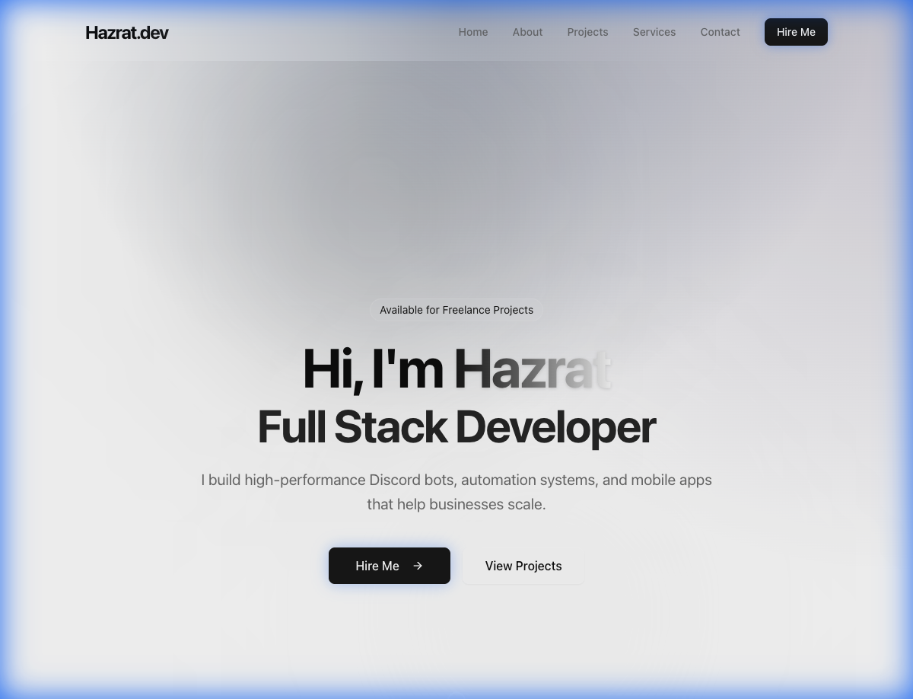
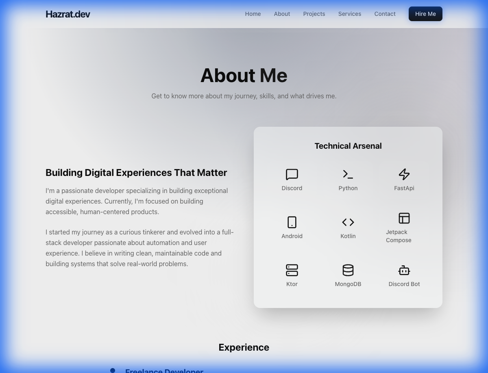
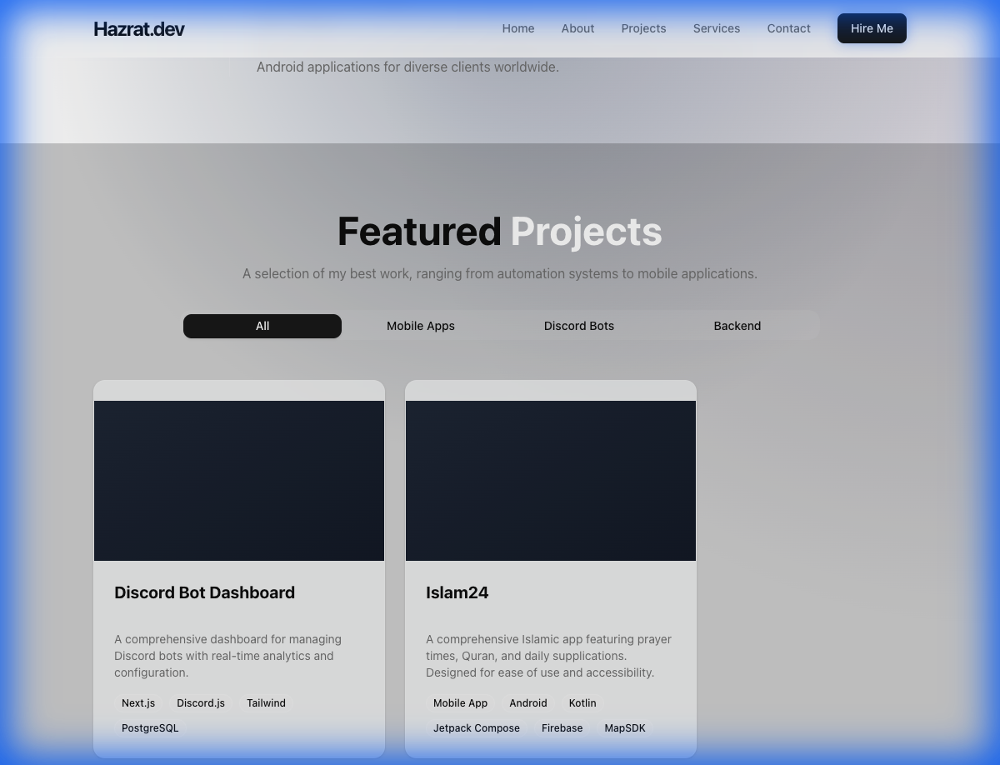
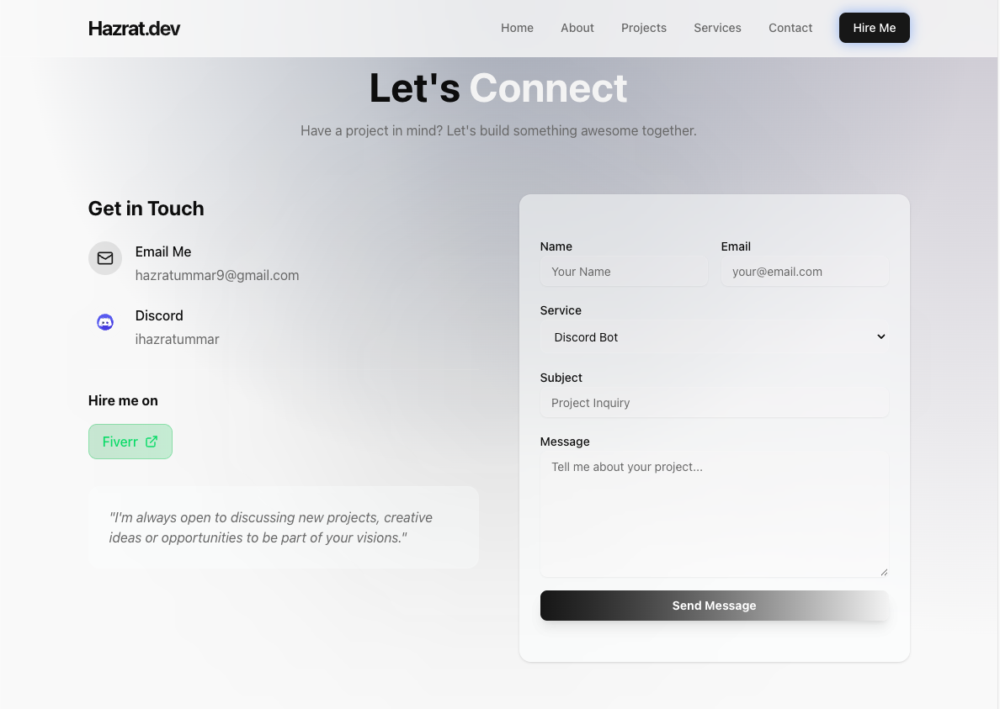

<div align="center">

# 🚀 MyFolio - Modern Portfolio Website

<p align="center">
  
</p>

[](https://nextjs.org/)
[](https://www.typescriptlang.org/)
[](https://tailwindcss.com/)
[](https://www.mongodb.com/)
[](https://www.docker.com/)

**A stunning, modern portfolio website built with Next.js, featuring dynamic content management, smooth animations, and a sleek dark theme.**

[Live Demo](https://yourwebsite.com) • [Report Bug](https://github.com/ihazratummar/MyFolio/issues) • [Request Feature](https://github.com/ihazratummar/MyFolio/issues)

</div>

---

## ✨ Features

### 🎨 **Modern Design**
- **Premium Dark Theme** with gradient accents and glassmorphism effects
- **Smooth Animations** powered by Framer Motion and GSAP
- **Fully Responsive** - looks stunning on all devices
- **Interactive UI Elements** with hover effects and micro-interactions

### 🛠️ **Tech Stack**
- **Frontend:** Next.js 14, React 18, TypeScript
- **Styling:** Tailwind CSS v4, Custom CSS animations
- **Database:** MongoDB with Mongoose ODM
- **Animations:** Framer Motion, GSAP
- **UI Components:** Radix UI primitives
- **Icons:** Lucide React
- **Deployment:** Docker-ready with multi-stage builds

### 📊 **Admin Panel**
- Secure authentication system
- Dynamic project management (Create, Edit, Delete)
- Real-time content updates
- Easy-to-use interface

### 🎯 **Key Sections**
- **Hero Section** - Eye-catching introduction with animated text
- **About** - Professional background and skills showcase
- **Projects** - Filterable portfolio with category tabs
- **Services** - Service offerings with pricing
- **Testimonials** - Client reviews carousel
- **Contact** - Multi-channel contact form with Discord webhook integration

---

## 📸 Screenshots

<details open>
<summary><b>🏠 Hero Section</b></summary>
<br>

</details>

<details>
<summary><b>👤 About Section</b></summary>
<br>

</details>

<details>
<summary><b>💼 Projects Section</b></summary>
<br>

</details>

<details>
<summary><b>🎯 Services Section</b></summary>
<br>

</details>

<details>
<summary><b>⭐ Testimonials Section</b></summary>
<br>

</details>

<details>
<summary><b>📧 Contact Section</b></summary>
<br>

</details>

---

## 🚀 Quick Start

### Prerequisites

- **Node.js** 18+ 
- **MongoDB** instance (local or Atlas)
- **npm** or **yarn** or **pnpm**

### Installation

1. **Clone the repository**
   ```bash
   git clone https://github.com/ihazratummar/MyFolio.git
   cd MyFolio
   ```

2. **Install dependencies**
   ```bash
   npm install
   ```

3. **Set up environment variables**
   ```bash
   cp .env.example .env.local
   ```
   
   Edit `.env.local` and add your credentials:
   ```env
   MONGODB_URI=your_mongodb_connection_string
   ADMIN_PASSWORD=your_secure_password
   ```

4. **Run the development server**
   ```bash
   npm run dev
   ```

5. **Open your browser**
   ```
   Navigate to http://localhost:3000
   ```

---

## 🐳 Docker Deployment

### Using Docker

**Build the image:**
```bash
docker build \
  --build-arg MONGODB_URI="your_mongodb_uri" \
  --build-arg ADMIN_PASSWORD="your_password" \
  -t myfolio:latest \
  .
```

**Run the container:**
```bash
docker run -d \
  --name myfolio-app \
  -p 3000:3000 \
  --env-file .env.local \
  -e NODE_ENV=production \
  myfolio:latest
```

### Using Docker Compose

```bash
docker-compose up -d
```

---

## 📁 Project Structure

```
myfolio/
├── src/
│   ├── app/              # Next.js app directory
│   │   ├── admin/        # Admin panel routes
│   │   ├── api/          # API routes
│   │   └── page.tsx      # Home page
│   ├── components/       # React components
│   │   ├── layout/       # Layout components (Navbar, Footer)
│   │   ├── sections/     # Page sections (Hero, About, etc.)
│   │   ├── modals/       # Modal components
│   │   └── ui/           # Reusable UI components
│   ├── lib/              # Utility libraries
│   ├── models/           # MongoDB models
│   └── data/             # Static data
├── public/               # Static assets
├── screenshots/          # README screenshots
├── Dockerfile            # Docker configuration
├── docker-compose.yml    # Docker Compose config
└── README.md            # This file
```

---

## 🎨 Customization

### Change Theme Colors

Edit `src/app/globals.css`:
```css
:root {
  --primary: your-primary-color;
  --secondary: your-secondary-color;
}
```

### Update Personal Information

Edit the admin panel at `/admin` or modify `src/data/portfolio.ts`

### Add New Sections

Create a new component in `src/components/sections/` and import it in `src/app/page.tsx`

---

## 🔐 Admin Panel

Access the admin panel at `/admin/login`

**Default Features:**
- ✅ Secure authentication
- ✅ Project CRUD operations
- ✅ Image upload support
- ✅ Real-time preview
- ✅ Category management

---

## 🌐 API Endpoints

| Endpoint | Method | Description |
|----------|--------|-------------|
| `/api/projects` | GET | Fetch all projects |
| `/api/projects` | POST | Create a project |
| `/api/projects/[id]` | GET | Fetch single project |
| `/api/projects/[id]` | PUT | Update a project |
| `/api/projects/[id]` | DELETE | Delete a project |
| `/api/services` | GET | Fetch all services |
| `/api/socials` | GET | Fetch social links |
| `/api/testimonials` | GET | Fetch testimonials |
| `/api/auth/login` | POST | Admin login |
| `/api/auth/logout` | POST | Admin logout |

---

## 🤝 Contributing

Contributions are welcome! Please feel free to submit a Pull Request.

1. Fork the project
2. Create your feature branch (`git checkout -b feature/AmazingFeature`)
3. Commit your changes (`git commit -m 'Add some AmazingFeature'`)
4. Push to the branch (`git push origin feature/AmazingFeature`)
5. Open a Pull Request

---

## 📝 License

This project is open source and available under the [MIT License](LICENSE).

---

## 💖 Acknowledgments

- **Design & Development:** [Hazrat Ummar Shaikh](https://github.com/ihazratummar)
- **Built with:** [Next.js](https://nextjs.org/), [Tailwind CSS](https://tailwindcss.com/), [MongoDB](https://www.mongodb.com/)
- **AI Assistant:** Powered by **[AntiGravity](https://deepmind.google/technologies/gemini/)** - Google DeepMind's advanced agentic AI coding assistant
- **Icons:** [Lucide Icons](https://lucide.dev/)
- **Animations:** [Framer Motion](https://www.framer.com/motion/), [GSAP](https://greensock.com/gsap/)

---

## 📞 Connect With Me

<div align="center">

[](https://yourwebsite.com)
[](https://github.com/ihazratummar)
[](https://www.linkedin.com/in/hazrat-ummar-shaikh/)
[](https://www.fiverr.com/hazratummar)

**Email:** hazratummar9@gmail.com  
**Discord:** ihazratummar

</div>

---

<div align="center">

### ⭐ Star this repo if you found it helpful!

Made with ❤️ by [Hazrat Ummar Shaikh](https://github.com/ihazratummar)

**AI Development Powered by AntiGravity**

</div>
